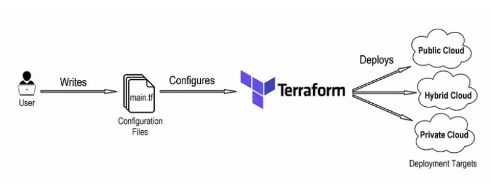
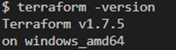
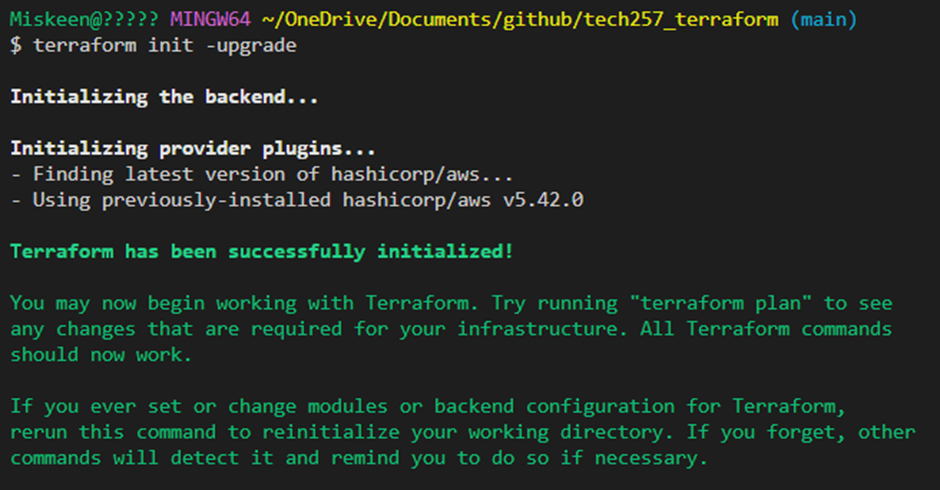
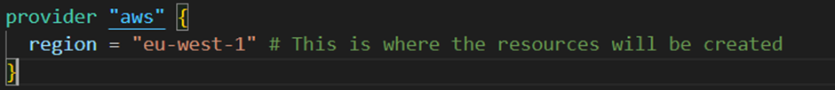
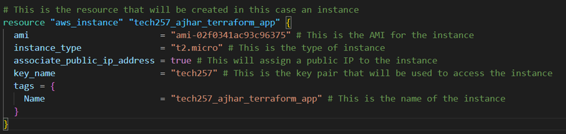
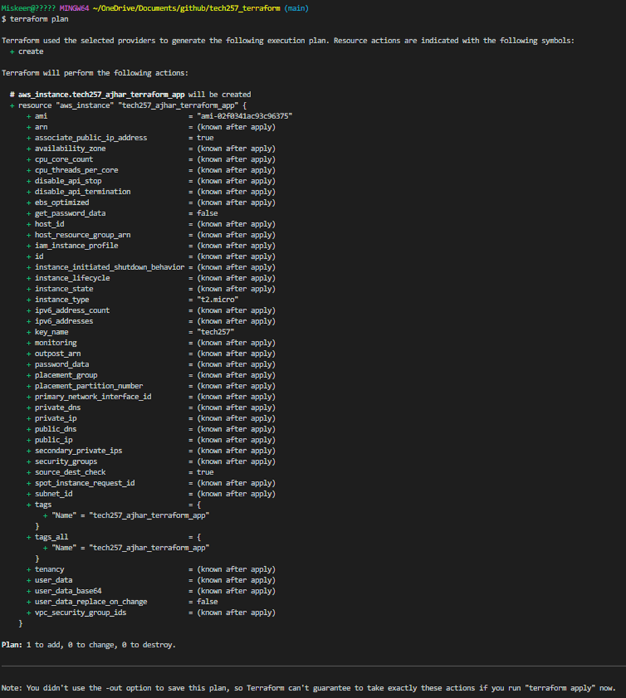
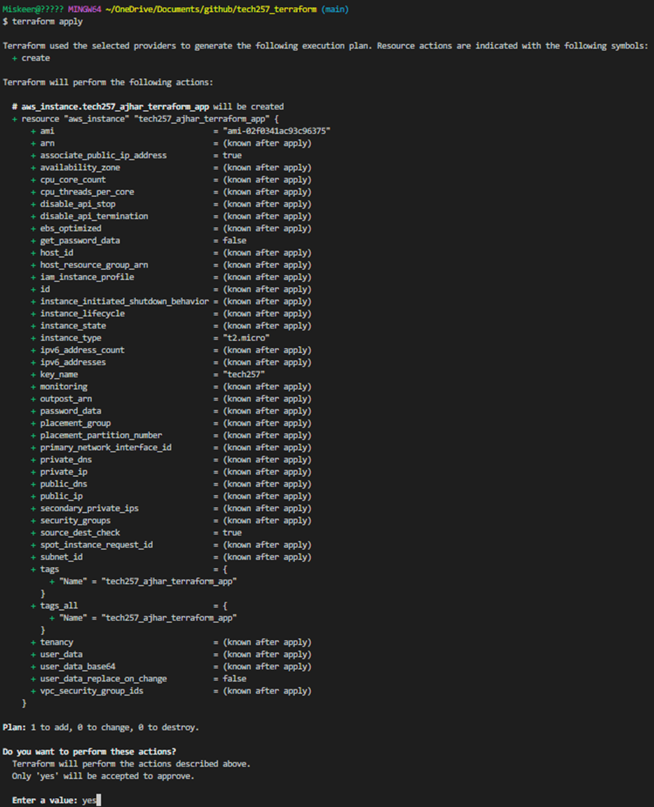
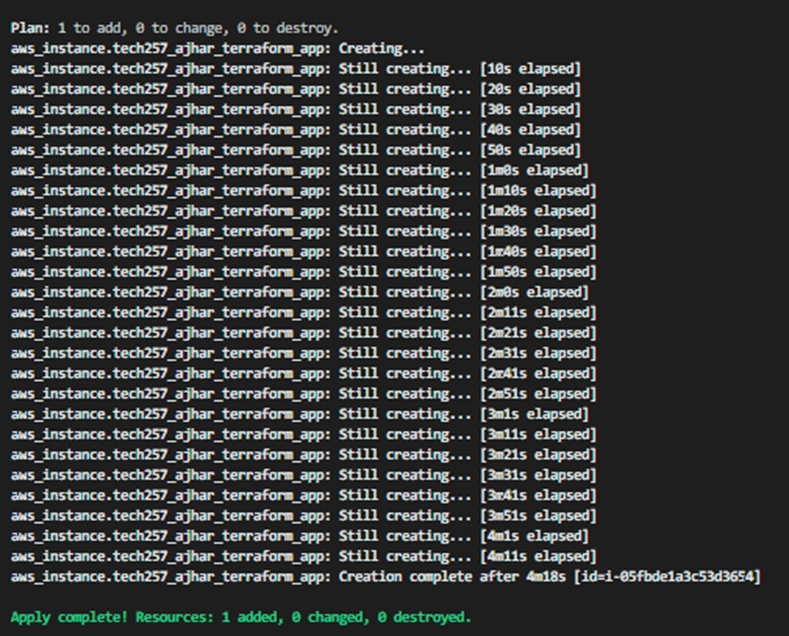
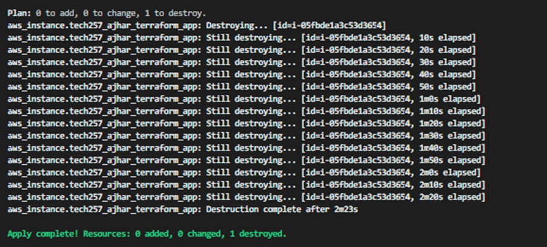

# Infrastructure as Code (IaC) - Terraform

### What is it
Infrastructure as Code (IaC) means managing and provisioning infrastructure using code instead of manual processes, a common one is Terraform.

### Why should we use it
Using Terraform ensures consistency, scalability, and faster deployments by automating infrastructure setup, this is because once you have the configurations file working you can recreate infrastructure by reusing them which is faster, avoids human error and can be automated further with cicd pipelines.


### When to use it
Use IaC when you need frequent deployments, dynamic environments, or large-scale infrastructure management.

### Where to use it
IaC can be used in cloud environments, on-premises data centers, and containerized environments.

### Tools available for IaC
Popular tools for IaC include Terraform, Ansible, AWS CloudFormation, Azure Resource Manager Templates, and Google Cloud Deployment Manager.

### Who is using IaC in the industry
Companies like Netflix, NASA, Red Hat, Atlassian, and Walmart use IaC for managing infrastructure and automating deployments.


# Getting Started with Terraform

To begin using Terraform for managing infrastructure on AWS, follow these steps:

1. **Install Terraform:**
   - Download and install Terraform on your local machine.
   - Verify the installation by checking the Terraform version to ensure it's properly installed.
    

2. **Configure AWS Access Keys:**
   - Set up your AWS access keys as environment variables on your local machine.
   - ```bash
      export AWS_ACCESS_KEY_ID="your-access-key-id"
      export AWS_SECRET_ACCESS_KEY="your-secret-access-key"
     ```
   - Keep these access keys private and avoid hardcoding in config files or exposing them in public repositories (Keep it far away from any git repositories).

3. **Initialize Terraform:**
   - Navigate to the directory where your Terraform configuration files will reside.
   - Run `terraform init` to initialize the directory as a Terraform workspace.
    
   - Select the provider (e.g., AWS) and region where your resources will be deployed.
    

4. **Create EC2 Instance:**
   - Define the configuration for the EC2 instance in your Terraform file.
   
   - Use Terraform to create a plan with `terraform plan` to review the changes before deployment.
   

5. **Deploy Infrastructure:**
   - Execute `terraform apply` to deploy the infrastructure defined in your Terraform configuration.
   - Confirm the plan and proceed with the deployment by entering `yes` when prompted.
   
   - After some time our resource is deployed!
   

6. **Verify Deployment:**
   - After deployment, verify that the AWS resources are provisioned as expected.
   - Access the AWS Management Console or use AWS CLI commands to check the status of the deployed resources.

7. **Destroy Infrastructure:**
   - When done with the resources, use `terraform destroy` to tear down the infrastructure.
   - Confirm the destruction plan and proceed with the destruction by entering `yes` when prompted.
  

By following these steps, we can get a glimpse of how powerful terraform is and see that we can effectively manage infrastructure on AWS using Terraform, allowing for quick provisioning, modification, and destruction of resources.