# Infrastructure as Code (IaC) - Terraform

### What is it
Infrastructure as Code (IaC) means managing and provisioning infrastructure using code instead of manual processes, a common one is Terraform.

### Why should we use it
Using Terraform ensures consistency, scalability, and faster deployments by automating infrastructure setup, this is because once you have the configurations file working you can recreate infrastructure by reusing them which is faster, avoids human error and can be automated further with cicd pipelines.


### When to use it
Use IaC when you need frequent deployments, dynamic environments, or large-scale infrastructure management.

### Where to use it
IaC can be used in cloud environments, on-premises data centers, and containerized environments.

### Tools available for IaC
Popular tools for IaC include Terraform, Ansible, AWS CloudFormation, Azure Resource Manager Templates, and Google Cloud Deployment Manager.

### Who is using IaC in the industry
Companies like Netflix, NASA, Red Hat, Atlassian, and Walmart use IaC for managing infrastructure and automating deployments.

## Pull and Push Configuration Management in IaC

- **Push Configuration**: Configuration changes are actively pushed from a central server to managed nodes, for example with Ansible, you write playbooks defining the desired state, and Ansible pushes these configurations to the nodes to ensure they match the desired state.
- **Pull Configuration**: Managed nodes periodically pull configurations from a central server to converge towards the desired state, for example In SaltStack, you define the desired state in Salt states (SLS files), and the managed nodes pull these states periodically to converge towards the desired state.
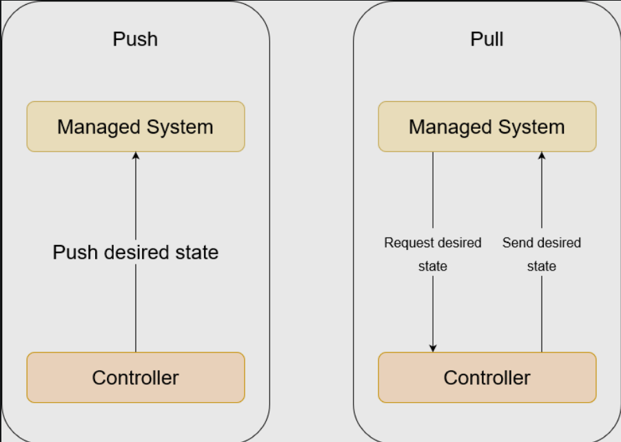

### Tools supporting Pull/Push
- **Push-based**: Tools like Ansible, Puppet, and Chef predominantly use a push-based approach. Ansible, for example, executes tasks on managed nodes by connecting to them remotely and pushing configurations.
  
- **Pull-based**: Tools like SaltStack and AWS OpsWorks support pull-based configuration management. These tools maintain a centralized repository of configuration states, and managed nodes pull configurations from this repository.

## Desired State vs Current State
- **Desired State**: In configuration management, the desired state refers to how the infrastructure should be configured according to the defined policies, configurations, or playbooks. It represents the ideal configuration that you want your infrastructure to be in.

- **Current State**: The current state is the actual configuration or state of the infrastructure at any given time. It may deviate from the desired state due to manual changes, drift, or other factors.

# Getting Started with Terraform

To begin using Terraform for managing infrastructure on AWS, follow these steps:

1. **Install Terraform:**
   - Download and install Terraform on your local machine.
   - Verify the installation by checking the Terraform version to ensure it's properly installed.
    

2. **Configure AWS Access Keys:**
   - Set up your AWS access keys as environment variables on your local machine.
   - ```bash
      export AWS_ACCESS_KEY_ID="your-access-key-id"
      export AWS_SECRET_ACCESS_KEY="your-secret-access-key"
     ```
   - Keep these access keys private and avoid hardcoding in config files or exposing them in public repositories (Keep it far away from any git repositories).

3. **Initialize Terraform:**
   - Navigate to the directory where your Terraform configuration files will reside.
   - Run `terraform init` to initialize the directory as a Terraform workspace.
    
   - Select the provider (e.g., AWS) and region where your resources will be deployed.
    

4. **Create EC2 Instance:**
   - Define the configuration for the EC2 instance in your Terraform file.
   
   - Use Terraform to create a plan with `terraform plan` to review the changes before deployment.
   

5. **Deploy Infrastructure:**
   - Execute `terraform apply` to deploy the infrastructure defined in your Terraform configuration.
   - Confirm the plan and proceed with the deployment by entering `yes` when prompted.
   
   - After some time our resource is deployed!
   

6. **Verify Deployment:**
   - After deployment, verify that the AWS resources are provisioned as expected.
   - Access the AWS Management Console or use AWS CLI commands to check the status of the deployed resources.

7. **Destroy Infrastructure:**
   - When done with the resources, use `terraform destroy` to tear down the infrastructure.
   - Confirm the destruction plan and proceed with the destruction by entering `yes` when prompted.
  

By following these steps, we can get a glimpse of how powerful terraform is and see that we can effectively manage infrastructure on AWS using Terraform, allowing for quick provisioning, modification, and destruction of resources.

## Creating Security Group with Terraform

1. **Define Security Group Rules:**
   - Create a Terraform configuration file specifying the rules to allow access on ports 22, 3000, and 80.
   - We should utilize dynamic blocks for improved readability and scalability.
   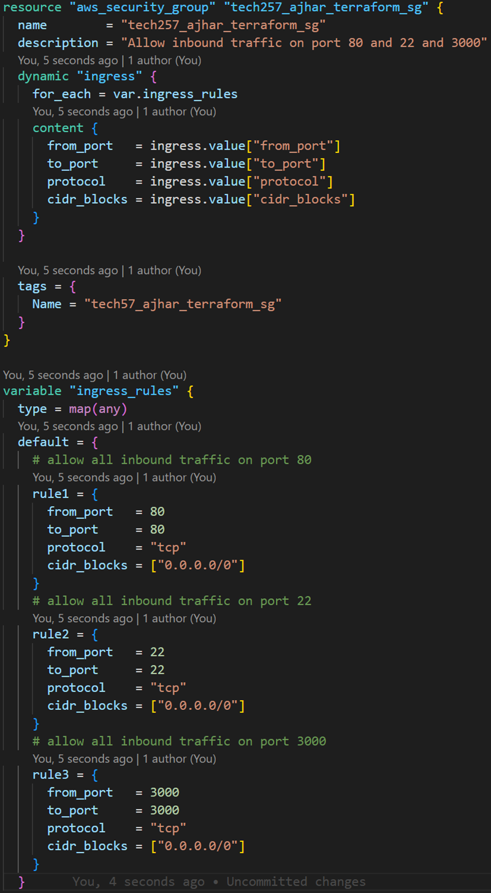

2. **Add Security Group to Instance Resource:**
   - Associate the created security group with the `aws_instance` resource in your Terraform configuration.
  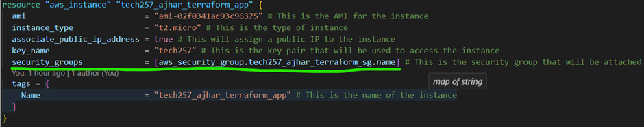

3. **Apply Terraform Changes:**
   - Run `terraform apply` to apply the changes defined in your Terraform configuration.
   - Verify that the security group is created successfully.git ad
    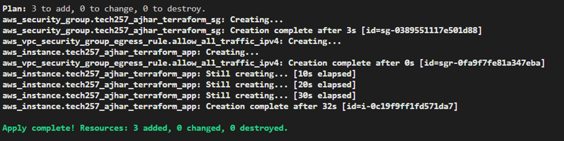

4. **Confirm Rules Configuration:**
   - Check the AWS Management Console or use AWS CLI commands to confirm that the security group has the intended rules configured.
   - Ensure that port 22 is allowed from all, port 3000 is allowed from all, and port 80 is allowed from all.
    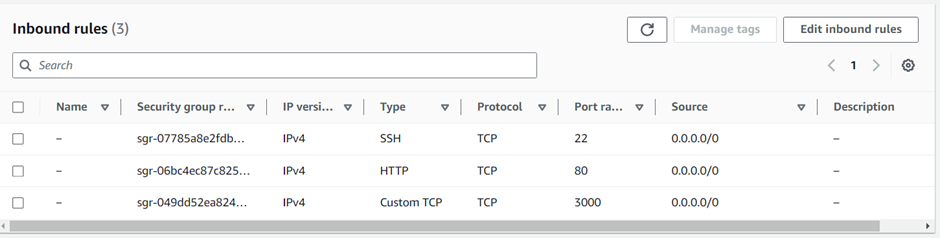

5. **Attach Key Pair and Security Group to EC2:**
   - Confirm that the EC2 instance is launched with the specified key pair and attached security group.
   - Verify that access to the EC2 instance is allowed on ports 22, 3000, and 80 as configured.

## Using Variables in Terraform Configuration

To enhance security and maintainability in our Terraform configuration, we will utilize variables instead of hardcoding values this makes our configuration files DRY.

1. **Create Variable Configuration:**
   - Create a `variables.tf` file to define variables for values that may change or should not be hardcoded, in our case we will do this for every value.
   - We must define variables for sensitive information such as access tokens, ensuring they are not stored in version control by adding `variables.tf` to the `.gitignore` file.
   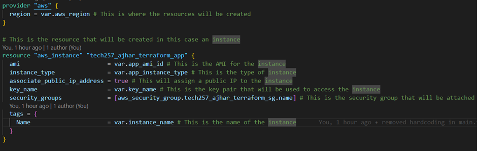

2. **Apply Terraform Changes:**
   - Run `terraform plan` and `terraform apply` again to ensure that the variables are configured properly.
   

Here we ensure that sensitive information is not exposed in our Terraform configuration and that our infrastructure is provisioned securely and efficiently.


## Creating GitHub Repository with Terraform

Now we will add a GitHub repository using Terraform.

1. **Generate Personal Access Token (PAT) on GitHub:**
   - Go to GitHub settings by clicking on your profile picture, then selecting `Settings`.<br>
   - 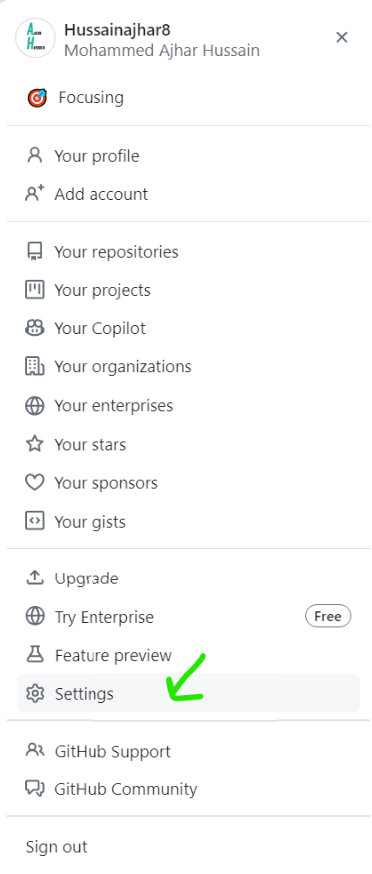<br>
   - Navigate to `Developer settings`<br>
     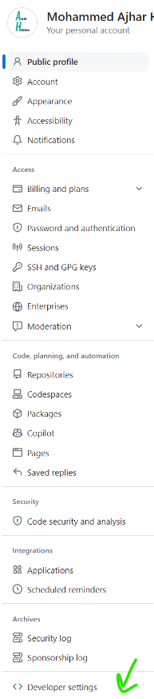<br>
   - Choose `Personal access tokens` and click on `Generate new token`<br>
     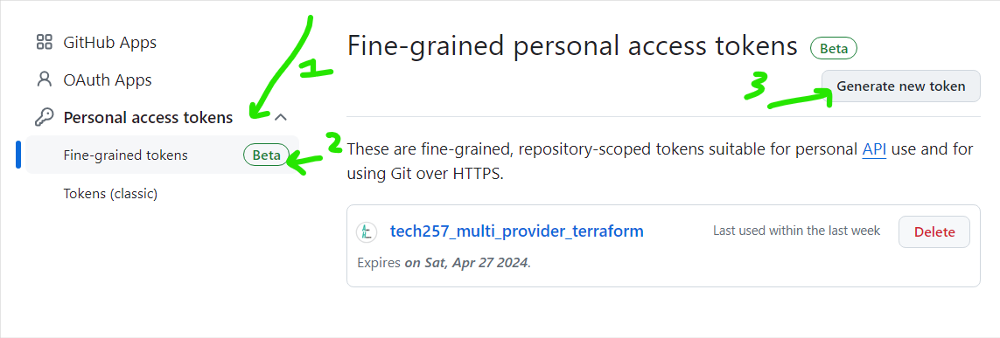<br>
   - Select the desired scopes for the token. For creating repositories, grant "repo" scope.<br>
   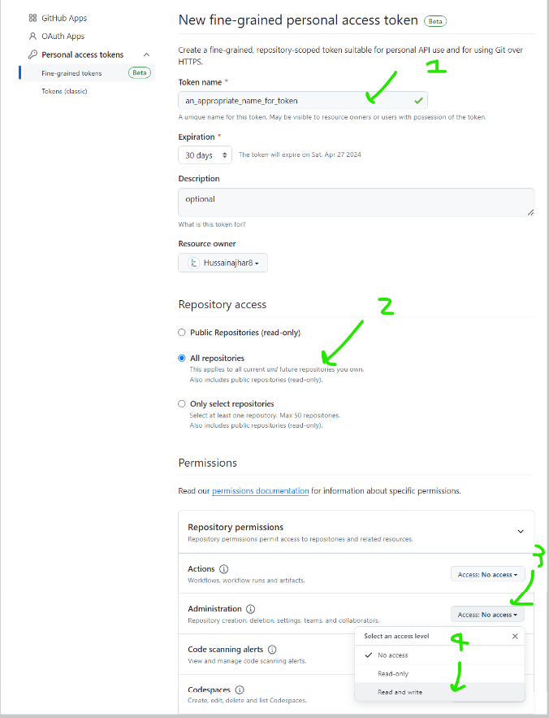<br>
   - Optionally, customize additional permissions based on your requirements.
   - Click on `Generate token` and securely store the generated token.

2. **Configure GitHub Resource:**
   - Refer to the Terraform documentation for GitHub to find the correct resource to create a repository.
   - Configure the resource with the necessary parameters, including the repository name and access token variable.
   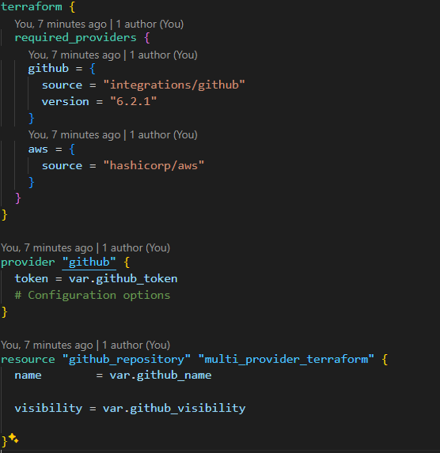

3. **Apply Terraform Changes:**
   - Run `terraform plan` and `terraform apply` to create the GitHub repository using the specified parameters.
   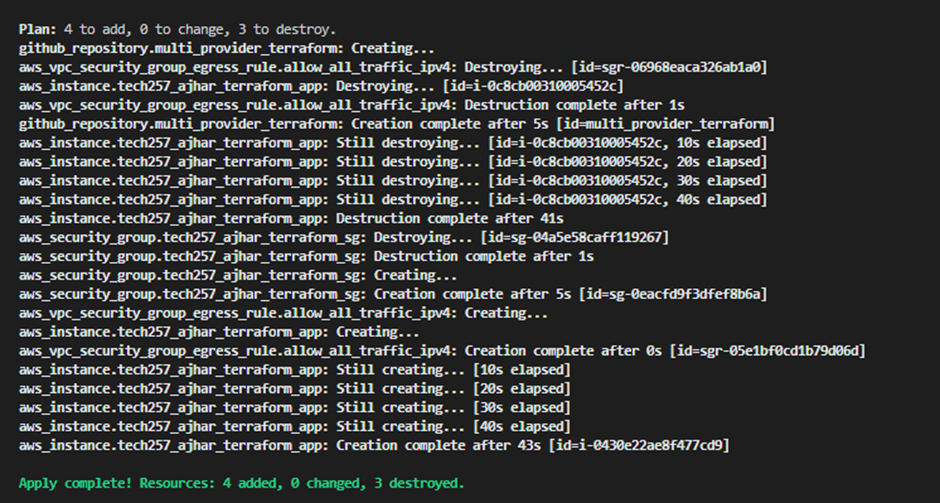
   - Confirm that the repository has been successfully created by checking GitHub or using Terraform outputs.
   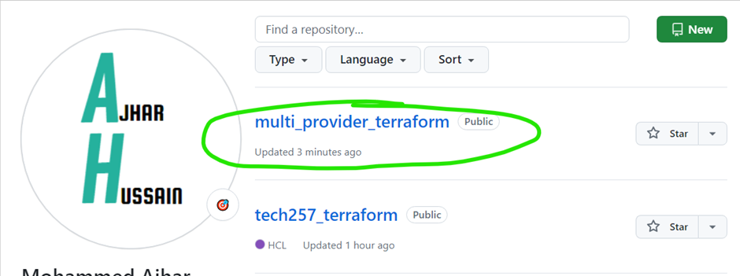
